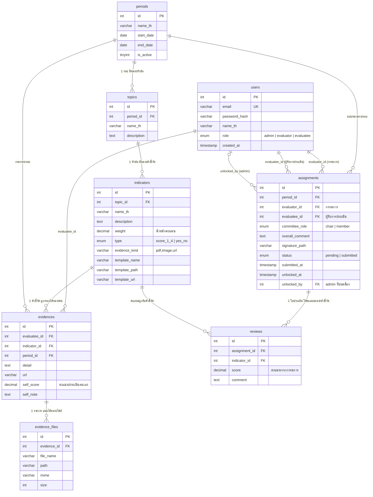

# ER Diagram — ระบบประเมินบุคลากร (PES)

ฐานข้อมูล `pes_db` มี **8 ตาราง** (ตรงตาม [schema.sql](schema.sql))
แบ่งเป็น 3 กลุ่มตามหน้าที่: **คน** (users) / **โครงการประเมิน** (periods → topics → indicators) / **ผลการประเมิน** (assignments, evidences, evidence_files, reviews)

---

## 1. แผนภาพรวม (Mermaid — เปิดใน VS Code / GitHub จะเห็นเป็นแผนภาพ)



---

## 2. แผนภาพอย่างง่าย (ASCII — ดูได้ทุกที่)

```
                    ┌─────────┐
                    │  users  │ (admin / evaluator / evaluatee)
                    └────┬────┘
          ┌──────────────┼──────────────────┐
          │ evaluator_id │ evaluatee_id     │ evaluatee_id
          ▼              ▼                  ▼
     ┌─────────────────────┐          ┌───────────┐
     │     assignments     │          │ evidences │ (ประเมินตนเอง)
     │  (ใบประเมิน 1 ใบ =  │          └─────┬─────┘
     │  กรรมการ 1 x ครู 1  │                │ 1:N
     │  ในรอบ 1)           │                ▼
     └──────────┬──────────┘          ┌────────────────┐
                │ 1:N                 │ evidence_files │ (ไฟล์แนบ)
                ▼                     └────────────────┘
          ┌──────────┐
          │ reviews  │ (คะแนนกรรมการ รายตัวชี้วัด)
          └──────────┘

     periods ──1:N──► topics ──1:N──► indicators
     (รอบ)           (หัวข้อ)        (ตัวชี้วัด + weight)
        │                                  ▲
        │ period_id ผูกใน:                 │ indicator_id ผูกใน:
        └── assignments, evidences         └── evidences, reviews
```

---

## 3. ตารางความสัมพันธ์ทั้งหมด (FK ครบทุกเส้น)

| # | ตารางลูก.field | → ตารางแม่ | ความหมาย | ลบแม่แล้วลูกเป็นยังไง |
|---|---|---|---|---|
| 1 | `topics.period_id` | `periods` | หัวข้อสังกัดรอบประเมิน (คนละรอบตั้งหัวข้อของตัวเองได้) | CASCADE — ลบรอบ หัวข้อหายตาม |
| 2 | `indicators.topic_id` | `topics` | ตัวชี้วัดสังกัดหัวข้อ | CASCADE |
| 3 | `assignments.period_id` | `periods` | ใบประเมินสังกัดรอบ | CASCADE |
| 4 | `assignments.evaluator_id` | `users` | กรรมการผู้ให้คะแนน | RESTRICT — ห้ามลบ user ที่มีใบประเมิน |
| 5 | `assignments.evaluatee_id` | `users` | ผู้รับการประเมิน | RESTRICT |
| 6 | `assignments.unlocked_by` | `users` | admin คนที่ปลดล็อกใบประเมิน (NULL ได้) | RESTRICT |
| 7 | `evidences.evaluatee_id` | `users` | เจ้าของข้อมูลประเมินตนเอง | CASCADE |
| 8 | `evidences.indicator_id` | `indicators` | กรอกรายตัวชี้วัด | CASCADE |
| 9 | `evidences.period_id` | `periods` | กรอกรายรอบ | CASCADE |
| 10 | `evidence_files.evidence_id` | `evidences` | ไฟล์แนบของรายการประเมินตนเอง | CASCADE |
| 11 | `reviews.assignment_id` | `assignments` | คะแนนสังกัดใบประเมิน | CASCADE |
| 12 | `reviews.indicator_id` | `indicators` | คะแนนรายตัวชี้วัด | CASCADE |

## 4. UNIQUE KEY — กฎกันข้อมูลซ้ำ (จุดที่มักออกสอบ/บั๊กบ่อย)

| ตาราง | UNIQUE | ความหมายเชิงธุรกิจ |
|---|---|---|
| `users` | `email` | อีเมลใช้เป็น username ห้ามซ้ำ |
| `assignments` | `(period_id, evaluator_id, evaluatee_id)` | กรรมการ 1 คน ประเมินครู 1 คน ได้ใบเดียวต่อรอบ |
| `evidences` | `(evaluatee_id, indicator_id, period_id)` | ครู 1 คน กรอกตัวชี้วัดละ 1 แถวต่อรอบ (กดบันทึกซ้ำ = update ไม่ใช่เพิ่มแถว) |
| `reviews` | `(assignment_id, indicator_id)` | ใบประเมิน 1 ใบ ให้คะแนนตัวชี้วัดละ 1 ครั้ง |

## 5. แนวคิดออกแบบที่ควรอธิบายให้เด็กเข้าใจ (ใช้สอน + ตอบกรรมการ)

1. **`assignments` คือหัวใจของระบบ** — 1 แถว = "ใบประเมิน 1 ใบ" ที่จับคู่ (รอบ × กรรมการ × ผู้รับการประเมิน) ทุกคะแนนของกรรมการ (`reviews`) ห้อยอยู่ใต้ใบนี้ ไม่ได้ห้อยกับ user ตรงๆ → ทำให้กรรมการหลายคนประเมินครูคนเดียวกันแยกกันได้ และรองรับ chair/member
2. **สายเนื้อหาแยกจากสายผลลัพธ์** — `periods → topics → indicators` คือ "แบบฟอร์ม" (admin ตั้ง) ส่วน `assignments/evidences/reviews` คือ "คำตอบ" (คนกรอก) — ลบ/แก้แบบฟอร์มกระทบคำตอบผ่าน CASCADE
3. **`evidences` vs `reviews` คือมุมมองคนละฝั่งของตัวชี้วัดเดียวกัน** — evidences = ครูประเมินตนเอง (`self_score`), reviews = กรรมการให้คะแนนจริง (`score`) → รายงานเทียบ 2 ค่านี้ได้
4. **แยกตารางไฟล์ (`evidence_files`) ออกจาก `evidences`** — เพราะ 1 ตัวชี้วัดแนบได้หลายไฟล์ (1:N) ถ้าเก็บ path ในตารางเดียวจะแนบได้ไฟล์เดียวหรือต้องยัด CSV ซึ่งผิดหลัก normalization
5. **`users` ตารางเดียวใช้ 3 บทบาท** — แยกด้วย `role` แทนการสร้าง 3 ตาราง → โค้ด auth/login ชุดเดียว และคนเดียวถูกอ้างได้หลายมุม (เป็นกรรมการใน assignment หนึ่ง เป็น admin ปลดล็อกอีก assignment หนึ่ง)
